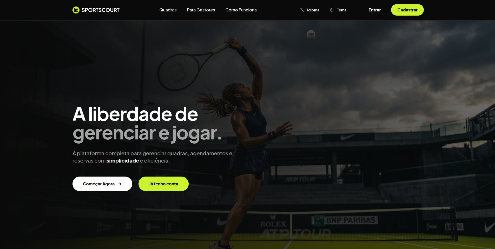

# 🏆 SportsCourt - Gestão de Quadras Esportivas

<div align="center">
  <a href="https://sportscourt.site/" target="_blank">
    
  </a>
</div>

<br />

O **SportsCourt** é uma plataforma completa para gestão de quadras, agendamentos e reservas, focada em simplicidade e eficiência para gestores e jogadores.



---

## 🚀 Tecnologias

### Backend
- **C# / .NET 9** (Web API)
- **SQL Server** (Persistência de Dados)
- **Entity Framework Core**
- **xUnit & FluentAssertions** (Testes Automatizados)
- **FluentValidation** (Validação de Dados)
- **JWT** (Autenticação e Autorização)
- **Docker** (Conteinerização)

### Frontend
- **React** (Vite)
- **TypeScript**
- **Tailwind CSS** (Estilização)
- **Lucide React** (Ícones)
- **i18next** (Suporte Multi-idioma: PT/EN)
- **Framer Motion** (Animações)

---

## 📦 Como Rodar Localmente

### Pré-requisitos
- [.NET 9 SDK](https://dotnet.microsoft.com/download)
- [Node.js](https://nodejs.org/) (v18+)
- [Docker](https://www.docker.com/) (para o banco de dados)

### 1. Clonar o repositório
```bash
git clone https://github.com/VitoriaSoder/Tekann-Projeto.git
cd Tekann-Projeto
```

### 2. Configurar variáveis de ambiente
```bash
cp .env.example .env
```
Edite o `.env` e defina uma senha para o banco. Os valores padrão já funcionam para desenvolvimento.

### 3. Subir o banco de dados
```bash
docker compose up -d
```
> O SQL Server ficará disponível em `localhost:1433`.

### 4. Rodar a API
```bash
cd API
dotnet restore
dotnet run --project Gateway/WebAPI/WebAPI.csproj
```
> A API estará disponível em: `http://localhost:5000`

### 5. Rodar o Frontend
Em outro terminal:
```bash
cd React
npm install
npm run dev
```
> O frontend estará disponível em: `http://localhost:5173`

---

## 🧪 Testes

O projeto possui uma suíte completa de testes automatizados (Unidade e Integração).

```bash
cd API
dotnet test
```

---

## 🐳 Rodando com Docker (Produção)

Para subir o ambiente completo (Banco + API + Frontend) em modo produção:
```bash
docker compose -f docker-compose.prod.yml up -d --build
```

---

## 📄 Licença

Este projeto foi desenvolvido para fins de teste técnico.
Desenvolvido por [Vitoria Eduarda Soder](https://github.com/VitoriaSoder).
